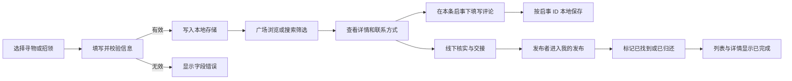
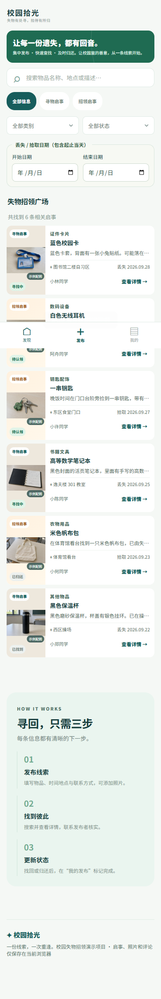
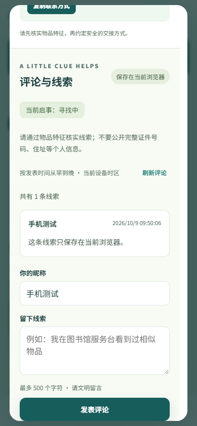

# 2026 秋软件工程第二次结对作业：校园拾光的程序实现

> 这是可整理到博客园的草稿。本次最终采用纯前端方案；个人分工、PSP、结对经历和评价仍需本人核实。方括号内容须依据真实过程填写。

| 项目 | 内容 |
| --- | --- |
| 课程 | [2026 软件工程与软件工程实践](https://edu.cnblogs.com/campus/fzu/2026-01SoftwareEngineeringandSoftwareEngineeringPractice/) |
| 作业要求 | https://edu.cnblogs.com/campus/fzu/2026-01SoftwareEngineeringandSoftwareEngineeringPractice/homework/16745 |
| 结对成员 | 052402234 郭泽强；032401339 沈冠宇 |
| 双方博客 | [郭泽强](https://www.cnblogs.com/imxiaoguo/)；[沈冠宇](https://www.cnblogs.com/tdxhr/) |
| 本文链接 | [发布后填写] |
| GitHub 主仓库 | [052402234-032401339](https://github.com/monkery-king-nice/052402234-032401339) |
| 我的 Fork | [2074599796-cpu / 052402234-032401339](https://github.com/2074599796-cpu/052402234-032401339) |
| 本次 Pull Request | [推送完成后填写真实 PR 链接] |
| 第一次原型 | https://www.figma.com/proto/OVO3mZl0VE9Ro4oNSJZrFY?page-id=0%3A1&node-id=2-2&starting-point-node-id=2%3A2&scaling=scale-down&content-scaling=fixed |

## 1. 分工与结对过程

[由两位同学填写真实分工、讨论方式、各自负责的模块、fork/PR 记录。不要虚构 PR 或共同编码经历。]

## 2. PSP

以下为待填写模板。课程要求预估时间在开发前记录，实际时间在开发后填写；如果此前没有记录，请如实说明，不要倒填成事前记录。

| PSP2.1 | 工作内容 | 预估/分钟 | 实际/分钟 | 偏差说明 |
| --- | --- | ---: | ---: | --- |
| Planning / Estimate | 计划与估算 | [填] | [填] | [填] |
| Analysis | 需求分析和技术学习 | [填] | [填] | [填] |
| Design Spec | 设计文档 | [填] | [填] | [填] |
| Design Review | 设计复审 | [填] | [填] | [填] |
| Coding Standard | 代码规范 | [填] | [填] | [填] |
| Design | 具体设计 | [填] | [填] | [填] |
| Coding | 编码 | [填] | [填] | [填] |
| Code Review | 代码复审 | [填] | [填] | [填] |
| Test | 测试及修正 | [填] | [填] | [填] |
| Reporting / Test Report | 报告和测试报告 | [填] | [填] | [填] |
| Size Measurement | 工作量统计 | [填] | [填] | [填] |
| Postmortem | 总结与改进 | [填] | [填] | [填] |
| **合计** | | **[填]** | **[填]** | |

## 3. 解题思路与设计实现

程序采用 HTML、CSS 和 JavaScript，通过浏览器本地存储保存启事、照片、状态和评论。测试人员下载完整项目后直接用 Google Chrome 打开 `index.html`，无需启动共享程序、连接后台或部署平台。模型层负责输入校验、组合筛选、状态转换、删除与本地存储；页面层负责卡片、表单、详情、评论和反馈。页面沿用第一次原型的“校园拾光”主题，保留绿色 / 米白主色和对应物品的写实图片。




### 关键实现一：发布校验

`js/model.js` 的 `validateDraft` 对类型、名称长度、类别、地点、真实日历日期、描述、联系方式和称呼逐项校验，返回字段错误对象；`createItem` 只接受通过校验的数据，清理首尾空格，并附加发布者标识、状态与时间。页面会把错误显示在对应输入项下方。

### 关键实现二：搜索与状态维护

`filterItems` 将关键词与类型、类别、状态过滤组合使用，关键词可命中名称、类别、地点和描述。`updateStatus` 在状态转换前验证发布者标识，并拒绝不存在的记录或非法状态；页面更新后立即写入本地存储并刷新列表。

### 关键实现三：日期筛选

本次在广场增加开始日期与结束日期，明确按“丢失 / 拾取日期”筛选，与发布时间区分。两端包括当天，单侧输入时另一侧不限，都为空时不限制；可以与关键词、类型、类别、状态共同使用。开始晚于结束时提示错误并保留输入，暂不展示容易误解的结果；清除按钮复位全部条件。

程序比较有效的 `YYYY-MM-DD` 日历字符串，不把日期转换为本地时区时间点，避免一天偏差。

### 关键实现四：本地评论与线索

详情下方展示昵称、正文与发表时间，按时间从早到晚排列，同一时间保持插入顺序。昵称 2～24 个字符，正文 1～500 个字符，提交前去除首尾空白。保存过程中禁用按钮；失败保留输入；成功后更新列表并清空正文。评论通过 `textContent` 作为普通文字展示，不作为 HTML 执行。

每条启事的评论使用独立 `localStorage` 键，以启事 ID 关联，刷新后仍可读取，互不混用。**本次最终要求是纯前端：评论只在当前浏览器保存，不同浏览器、无痕会话或设备不会同步。本地留言不能描述为已经完成多人共享的公共评论。**

升级保留原 `campus-light-items-v1` 和 `campus-light-owner-v1`，不通过清空数据完成升级。已完成启事仍能查看评论，并显示当前状态。发布者标识用于演示中的页面操作限制，不是服务端身份认证。

下面是实际使用的评论关联与安全展示代码：

```js
function commentStorageKey(itemId) {
  if (!clean(itemId)) throw new Error('缺少启事标识');
  return COMMENTS_KEY + encodeURIComponent(itemId);
}
```

每条启事生成不同的存储键，读取和保存均使用该键，避免线索串到其他启事。编码 ID 也避免特殊字符与普通 ID 冲突。

```js
const text=document.createElement('p');
text.textContent=comment.body;
```

评论正文只作为文字填入节点，即使输入包含 HTML 标签，也不会生成图片或运行脚本。

## 4. 附加特点

1. **多维筛选与空结果提示**：日期、关键词、信息类型、物品类别和状态可组合；未匹配时明确提示并提供清除入口。
2. **一键复制联系方式**：减少手动抄录错误；若浏览器剪贴板 API 不可用，使用兼容方式复制。
3. **误标记可恢复**：发布者可将已完成线索重新设为进行中，避免操作失误让线索消失。
4. **移动端布局与键盘快捷键**：窄屏提供底部导航，桌面按 `/` 可直接聚焦搜索框。
5. **照片与信息层级**：保留六张写实示例图片与用户上传照片，整理物品名称、地点、日期和状态；统一表单、按钮、卡片和焦点样式。
6. **评论反馈**：提供空状态、保存反馈、字段提示、失败保留与隐私提醒，已完成启事仍显示当前状态和评论。

2026-10-10 使用 Google Chrome 直接打开本地 HTML 生成了以下截图。发布到博客园时，将仓库中的真实图片上传并替换图片路径。







## 5. 目录和运行方法

目录见仓库 `README.md`。下载完整项目后，用 Google Chrome 打开 `index.html`，无需启动服务或安装依赖。关闭旧共享程序后，日期筛选、本地评论、上传照片和原有功能仍应可用。启事、照片与评论保存在当前浏览器，刷新后可读，不能跨设备同步。

## 6. 单元测试

业务规则使用 Node.js 内置的 `node:test` 和 `node:assert/strict`，无需第三方依赖。学习方法：将纯业务规则放在 `js/model.js`，针对正常路径、错误路径和边界构造数据，用 `assert` 比较预期与实际，运行 `node --test tests/*.test.js` 查看报告。

一个最小示例：

```js
test('非发布者无法修改状态', () => {
  assert.throws(
    () => M.updateStatus([make()], 'id-1', 'owner-b', 'resolved'),
    /只有发布者/
  );
});
```

白盒设计针对发布字段校验、组合筛选、状态 / 删除限制、存储有效 / 损坏分支构造数据。本次补充日期当天边界、单侧 / 无条件 / 无效范围，以及评论空白 / 超长、启事关联、持久化和保存错误测试。

Google Chrome 页面验收使用 Playwright，执行：

```bat
npm ci
npm run test:browser
```

Node.js 与开发依赖仅用于测试，日常打开网页无需安装。页面测试直接打开本地 HTML，使用独立 Chrome 上下文和数据，不清空原用户存储，覆盖刷新保存、评论隔离、HTML 文字展示、失败输入保留、日期清除、图片上传、状态维护、二次确认删除及桌面 / 手机布局。

**2026-10-10 实际结果：47 / 47 个业务规则测试通过，10 / 10 个 Chrome 页面场景通过。** 浏览器为 Google Chrome 154.0.8037.93。共享程序关闭，8787 无服务监听；浏览器启用离线模式，直接打开 `index.html`，HTTP 请求为 0。

本次确认日期边界与组合条件、评论刷新保存与启事隔离、失败后输入和原评论保留、损坏存储不覆盖、HTML 文字安全显示、旧启事 / 图片 / 发布者身份兼容、照片上传压缩与保存、状态维护、删除只清理目标评论、320 / 390 / 768 像素布局，以及复制联系方式后剪贴板读取一致。独立浏览器会话不会同步评论，符合最终纯前端范围。已提交的结构化结果位于 `docs/browser-tests.json`，单元测试原始记录为 `docs/unit-tests.xml`。

[如博客需要终端结果图片，再补充实际运行截图；不得用伪造图片代替记录。当前测试结论依据真实自动化运行及结构化结果。]

## 7. 代码签入记录

[插入 GitHub 真实 commit 历史截图，解释各次提交与功能划分的关系；另一位同学的 fork / Pull Request 记录也应如实展示。]

## 8. 问题、尝试和收获

本次运行方案发生了一次明确调整：由共享服务改为直接打开本地 HTML。因此需要同时更改评论存储、连接入口、测试方式与 README，确保最终运行条件覆盖所有页面功能。评论本地保存的范围也需要在页面、文档和 PR 中说明，不能将它写成多人共享能力。

[本人可按「问题 → 做过的尝试 → 实际结果 → 收获」补充真实经历，不能编造讨论、耗时或结对细节。]

## 9. 对队友的评价

[郭泽强评价沈冠宇：值得学习的地方、需要改进的地方。]

[沈冠宇评价郭泽强：值得学习的地方、需要改进的地方。]

## 10. 局限与后续改进

本版使用 `localStorage`，不同浏览器或设备无法同步数据；浏览器发布者标识只是演示用权限。清理浏览器数据会丢失记录，移动文件路径可能无法读取旧存储，照片数量受浏览器容量限制。正式多人校园平台需要共享存储、可靠身份验证与内容审核，超出本次纯前端范围；不能写成已经实现的后台能力。
