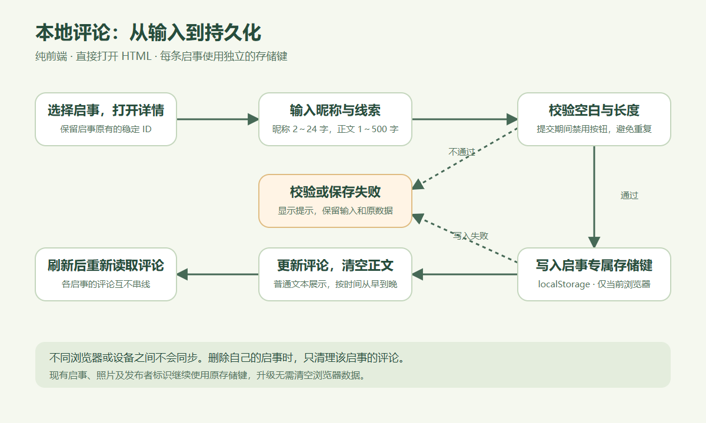
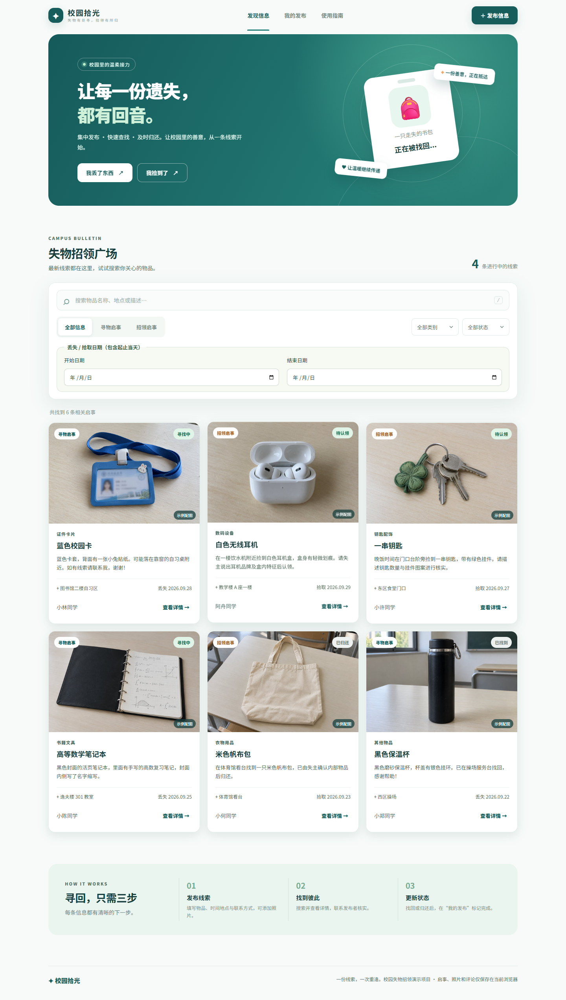
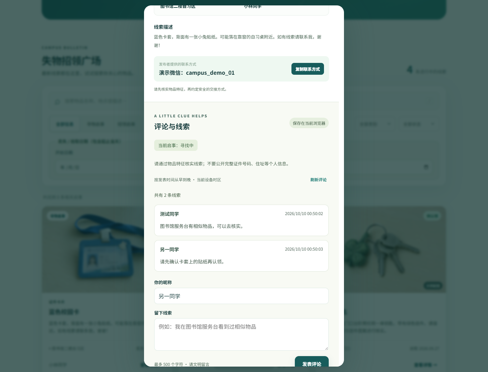
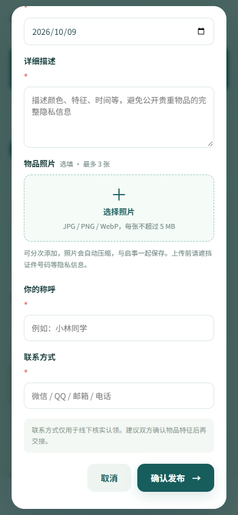
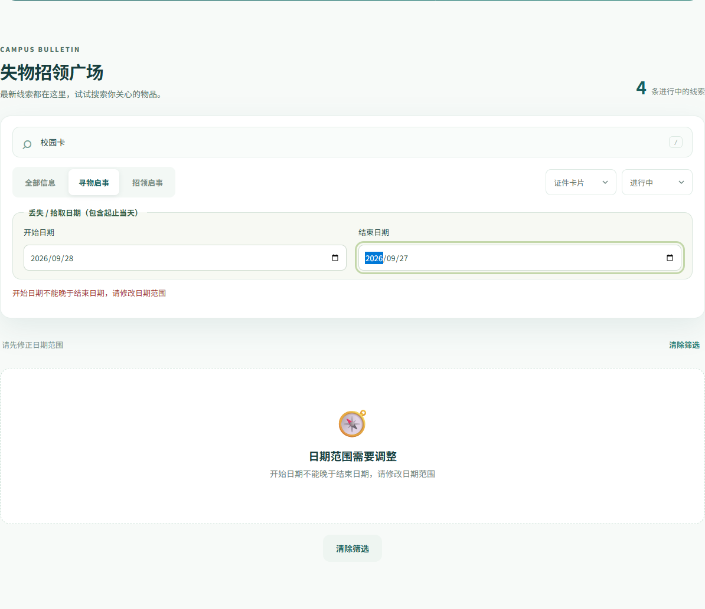
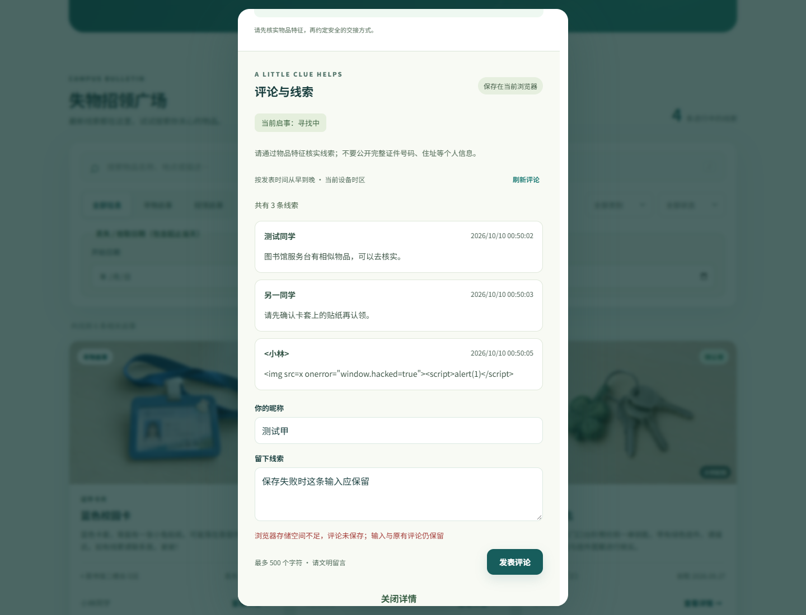

# 校园拾光：日期筛选、本地评论与界面调整

本次最终要求是纯前端：Google Chrome 直接打开 `index.html` 使用全部功能。评论只保存在当前浏览器，不需要共享程序、后台接口或部署平台，不提供跨浏览器 / 跨设备同步。

## 实际修改

- 保留日期范围筛选与界面优化，筛选依据明确为“丢失 / 拾取日期”。
- 评论改为 `localStorage`，每条启事按 ID 使用独立键，刷新保留且互不混用。
- 保留昵称 / 正文校验、空状态、保存反馈、失败保留输入与普通文字展示。
- 继续读取原启事 / 发布者键，保留照片与状态，不清空用户数据。
- 去掉共享服务、后端接口与部署配置依赖，测试直接打开本地 HTML。
- README 和博客草稿明确本地范围、使用方式和限制。

## 关键流程

**日期：** 获取日期 → 校验日历值和范围 → 与关键词、类型、类别、状态共同筛选 → 展示结果或空状态。无效范围保留输入并提示，清除入口复位全部条件。

**评论：** 打开详情 → 按启事 ID 读取独立记录 → 展示时间顺序列表或引导文字 → 校验去空白后的昵称 / 正文 → 保存 → 成功刷新列表、清空正文。失败保留输入，正文通过 `textContent` 输出。

**回归：** 发布独立测试启事和照片 → 查看卡片与详情 → 刷新检查保存 → 更新 / 恢复状态 → 取消删除 → 再确认删除。不清空已有用户数据。

## 本版本真实测试记录

2026-10-10 完成纯前端版本复验：**47 / 47 个业务规则测试、10 / 10 个 Google Chrome 页面场景全部通过**。Chrome 为 154.0.8037.93。共享程序已关闭，8787 无服务监听；浏览器设为离线，直接打开本地 `index.html`，HTTP 请求为 0。结果是本版本重新运行所得，没有沿用之前共享方案结果。

| 内容 | 命令 / 方式 | 本次结果 |
| --- | --- | --- |
| 业务规则 | `node --test tests/*.test.js` | 47 / 47 通过 |
| Chrome 页面验收 | `npm ci` 后 `npm run test:browser`，直接打开本地 HTML | 10 / 10 场景通过 |
| 关闭共享程序后直接运行 | Google Chrome 离线打开 `index.html` | 通过，HTTP 请求为 0 |
| 日期边界、组合条件和清除 | 独立测试启事 | 通过 |
| 评论刷新、隔离、安全文字、失败保留 | 独立 Chrome 上下文 | 通过，失败保留昵称 / 正文 / 原评论 |
| 图片、发布、状态与删除 | 独立测试照片与启事 | 通过，删除只清理目标启事评论 |
| 桌面 / 手机布局、弹窗滚动、底部导航 | Google Chrome，320 / 390 / 768 像素视口 | 通过 |

还验证了损坏评论存储报错且不覆盖、原启事 / 照片 / 发布者身份兼容、旧共享配置不影响本地功能，以及复制联系方式后真实读取剪贴板与预期一致。测试使用独立数据，没有清空用户原数据。结构化报告：[browser-tests.json](browser-tests.json)；单元测试原始记录：[unit-tests.xml](unit-tests.xml)。

本版不需要公共共享验收。其他浏览器会话不出现原会话启事 / 评论是预期行为，不能描述为公共评论已连通。

## 截图

以下图片均为本版本复验重新生成；原同名截图已更新：

| 文件 | 内容 |
| --- | --- |
| `desktop-square.png` | 桌面广场、日期筛选区与卡片 |
| `desktop-comments.png` | 桌面详情和本地评论 |
| `mobile-square.png` | 手机筛选、卡片和底部导航 |
| `mobile-comments.png` | 手机详情滚动与评论输入 |
| `mobile-publish.png` | 手机照片上传入口与表单提交 |
| `invalid-date.png` | 开始晚于结束，保留输入并提示 |
| `comment-storage-error.png` | 存储失败提示与保留的评论输入 |

## Git 协作

主仓库：[monkery-king-nice / 052402234-032401339](https://github.com/monkery-king-nice/052402234-032401339)。

Fork：[2074599796-cpu / 052402234-032401339](https://github.com/2074599796-cpu/052402234-032401339)。

开发分支：`feat/date-filter-comments-ui`。

[最终提交后补入本次真实 commit ID、消息与 PR 链接。如推送失败，说明真实错误，不写成已提交。]

## 本人待核实

结对成员：052402234 郭泽强、032401339 沈冠宇。博客：[郭泽强](https://www.cnblogs.com/imxiaoguo/)；[沈冠宇](https://www.cnblogs.com/tdxhr/)。

实际分工、PSP 事前预估 / 实际耗时、结对经历与队友评价，应由两位同学依据实际过程补充，不编造时间或结对经历。
